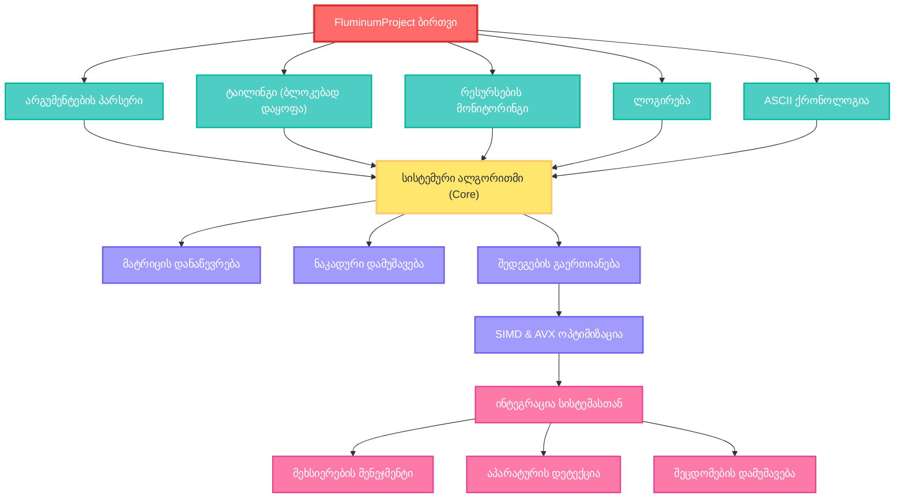

# Fluminum — მატრიცული გამოთვლები მაღალი მწარმოებლურობით C++-ზე (V2.3+)

          	

**Fluminum** არის **C++** ენაზე დაწერილი მაღალი მწარმოებლურობის კონსოლური პროგრამა, რომელიც განკუთვნილია მატრიცების გამრავლებისა და შედარებისთვის, თანამედროვე აპარატურული აქსელერაციის გათვალისწინებით. იგი ახდენს **SIMD** (ერთი ინსტრუქცია, მრავალი მონაცემი) და **AVX-256** (Advanced Vector Extensions) მეთოდების იმპლემენტაციას ოპერაციების ვექტორიზაციისთვის, რაც საშუალებას იძლევა ერთი ინსტრუქციით დამუშავდეს მონაცემთა მრავალი ელემენტი ერთდროულად. Fluminum-ს აქვს მულტინაკადიანობის (multithreading) და მულტიპროცესინგის მხარდაჭერა, რაც უზრუნველყოფს პროცესორის ყველა ხელმისაწვდომი ბირთვის ეფექტურ დატვირთვას გამოთვლების დასაჩქარებლად. პროგრამა აღჭურვილია რესურსების მონიტორინგით, სამუშაო პროცესის აღრიცხვით (logging) და შემაჯამებელი მატრიცების ფაილებში შენახვის ფუნქციით (მაგ. **CSV**); ასევე, გააჩნია მოსახერხებელი კონსოლური ინტერფეისი და დეტალური ლოგირების სისტემა. ქვემოთ მოცემულია პროგრამის ძირითადი მექანიზმები, მოდულები და რეკომენდაციები.

## 🔠 ენობრივი ვარიაციები დოკუმენტაციისთვის: 
 > [!TIP]
 > 
 > [ქართულ ენაზე ](https://github.com/Schreiry/fluminum/blob/main/README%5B%20%E1%83%A5%E1%83%90%20%5D.md)
 >
 > [На русском языке](https://github.com/Schreiry/fluminum/blob/main/Doc/%D0%9D%D0%B0%20%D0%A0%D1%83%D1%81%D1%81%D0%BA%D0%BE%D0%BC.md)
 >
 > [українською мовою](https://www.google.com/search?q=https://github.com/Schreiry/fluminum/blob/main/README.md)
 >
 > [en français](https://www.google.com/search?q=https://github.com/Schreiry/fluminum/blob/main/README.md)

## 📚 დოკუმენტაცია

- [📖 მომხმარებლის სახელმძღვანელო](https://github.com/Schreiry/fluminum/blob/main/Doc/User%20Guide.md)
- [🏗️ არქიტექტურის მიმოხილვა](docs/architecture.md)
- [⚡ მწარმოებლურობის ტიუნინგი](docs/performance.md)

## ძირითადი მახასიათებლები

- შტრასენის ალგორითმის რეკურსიული იმპლემენტაცია, ნაივურ (პირდაპირ) მეთოდზე გადასვლის კონფიგურირებადი ზღვრული მაჩვენებლით.

- ნაივური საბაზისო გამამრავლებელი, ოპტიმიზებული **SIMD** ინსტრუქციების გამოყენებით (**AVX → SSE2 → სკალარული**), აპარატურული მხარდაჭერის არსებობის შემთხვევაში.

- CPU ბირთვების ეფექტური გამოყენება.

- სისტემის შემოწმება: ლოგიკური/ფიზიკური ბირთვების დეტექცია, **SIMD** მხარდაჭერის შემოწმება, საჭირო მეხსიერების შეფასება და გაფრთხილებები მოსალოდნელი პიკური დატვირთვის შესახებ.

- არაშემოსაზღვრული შემავალი მონაცემების დამუშავება: მატრიცების ავტომატური შევსება/შკვეცა (padding/unpadding), მონაცემების მიღება ფაილიდან/კონსოლიდან/შემთხვევითი რიცხვების გენერატორიდან.

- კონსოლური ინტერფეისი: პროგრესის მაჩვენებელი (progress bar), სტრუქტურირებული გამოტანა, **CSV ლოგირება**, ხმოვანი შეტყობინებები (არჩევითი).

- კომპიუტერის მწარმოებლურობის მეტრიკების თვალყურის დევნება.

- **EPCP** სისტემა — კომპიუტერის მწარმოებლურობის წინასწარი შეფასება.

- **ტაილინგი** (Tiling) — მატრიცების ბლოკური გამრავლება.

# ოპტიმიზაცია მატრიცების გამრავლებაში

### ტრადიციული ალგორითმი და მისი ნაკლოვანებები

მათემატიკური განსაზღვრების მიხედვით, n×n განზომილების მატრიცების გამრავლება სრულდება სამი ჩადგმული ციკლით (**i**, **j**, **k**) და მოითხოვს **Θ(n³)** რაოდენობის გამრავლებისა და შეკრების ოპერაციას.
ნაივური იმპლემენტაცია პარალელურია n-ის მიმართ, მაგრამ მისი პრაქტიკული ეფექტურობა უკიდურესად დაბალია: გამოყენებული მეხსიერების მასშტაბის გამო, პროცესორი დროის უმეტეს ნაწილს ატარებს უქმად, RAM-დან მონაცემების მიღების ლოდინში. შეფასებულია, რომ მსგავსი იმპლემენტაციისას, ნელი მეხსიერების გამო, პროცესორები იტვირთება მათი შესაძლებლობების მხოლოდ მცირე ნაწილით. მაგალითად, **AVX2** მხარდაჭერის მქონე კომპიუტერი ნაივური ალგორითმის გამოყენებისას ასრულებს ოპერაციების თეორიული რაოდენობის მხოლოდ **7%**-ს წამში.

### SIMD ვექტორიზაცია და AVX

აჩქარებისკენ გადადგმული პირველი ნაბიჯი არის CPU-ს SIMD გაფართოებების გამოყენება. ელემენტარული გამრავლების ნაცვლად, Fluminum იყენებს AVX ინსტრუქციებს, რომლებიც ასრულებენ რამდენიმე გამრავლებასა და შეკრებას ერთდროულად. პრაქტიკაში ალგორითმი ტრანსფორმირდება შემდეგნაირად: სკალარული ელემენტი **A[i][k]** იტვირთება **SIMD** რეგისტრში, შემდეგ მრავლდება 8 თანმიმდევრული ელემენტისგან შემდგარ ვექტორზე **B[k][j..j+7]**. შედეგი არის 8 ელემენტიანი ვექტორი, რომელიც აკუმულირდება C გამომავალი მატრიცის შესაბამის პოზიციებზე. ამრიგად, ვექტორული ფორმულა ერთდროულად ითვლის 8 რიცხვს **C[i][j..j+7]**, მაშინ როცა კლასიკური ალგორითმი ამუშავებდა ერთ ელემენტს **C[i][j]**. ეს იძლევა ერთნაკადიანი ბირთვის დაახლოებით 8-ჯერად აჩქარებას (პარალელიზმის ხარისხი იზრდება შესაბამისად).
გარდა ამისა, Fluminum-ს შეუძლია გამოიყენოს FMA (fused multiply-add) ინსტრუქციები, რომლებიც ასრულებენ გამრავლებასა და შეკრებას ერთი ბრძანებით, რაც დამატებით ტვირთავს არითმეტიკულ-ლოგიკურ მოწყობილობას (ALU) და ამცირებს ზედნადებ ხარჯებს.

### ბლოკური გამრავლება (Tiling)

შემდგომი ოპტიმიზაცია წყვეტს მეხსიერების ლოკალურობის პრობლემას. Fluminum ყოფს დიდ მატრიცებს T×T ზომის მცირე "ტაილებად" (ფილებად) და ამრავლებს მათ ბლოკურად. ეს ნიშნავს, რომ შიდა ციკლი ოპერირებს არა ერთ ელემენტზე, არამედ მთლიან ბლოკზე, რომელიც სრულად ეტევა პროცესორის ქეშში. კვლევები აჩვენებს, რომ სწორად შერჩეული T-ს შემთხვევაში (დაახლოებით √(ქეშის ზომა)), ეს მიდგომა ამცირებს ქეშიდან მოცდენებს (cache misses) **Θ(n³)** ფაქტორით. Fluminum-ის მაგალითზე: თუ მატრიცა ზედმეტად დიდია, მისი გამრავლება იშლება ოპერაციების სერიად „გამრავლდეს A ტაილი B ტაილზე“ — მატრიცის ბლოკების ლოკალური ასლები „ბრუნავს“ **L1/L2 ქეშში**, ხოლო შედეგები აკუმულირდება გამომავალი მატრიცის ტაილებში. ეს მნიშვნელოვნად ამცირებს მიმართვებს ნელ მეხსიერებაზე, რაც დასტურდება სიჩქარის შესამჩნევი ზრდით: ექსპერიმენტებში, სწრაფად მოწესრიგებულმა ბლოკურმა გამრავლებამ აჩვენა 2–5-ჯერადი მოგება ნაივურ გამრავლებასთან შედარებით, იდენტურ მონაცემებზე.

### მულტინაკადიანობა და პარალელიზაცია

Fluminum ეფექტურად იყენებს CPU-ს ყველა ბირთვს: მუშაობა მატრიცის ბლოკებზე ბუნებრივად ნაწილდება ნაკადებს (threads) შორის. თითოეული ნაკადი იღებს C გამომავალი მატრიცის ბლოკების (ან სტრიქონების) საკუთარ დიაპაზონს, რომელზეც ასრულებს შესაბამისი A და B ქვემატრიცების გამრავლებას. ვინაიდან ბლოკები შედარებით დამოუკიდებელია, მათი გამოთვლისას სინქრონიზაციის შეფერხებები პრაქტიკულად არ არსებობს. თეორიულად, ამოცანების P ნაკადზე განაწილებამ უნდა გამოიწვიოს P-ჯერადი აჩქარება ერთნაკადიან გაშვებასთან შედარებით, თუმცა პრაქტიკაში სინქრონიზაციისა და რესურსების (მაგ. ქეშის გაზიარება) ზედნადები ხარჯები ოდნავ ამცირებს სკალირებას. ტესტების თანახმად, თანამედროვე 16-32 ნაკადიანი სისტემები აჩვენებენ ≈20-25× აჩქარებას. მაგალითად, ორბირთვიანი CPU-ს (4 ვირტუალური ნაკადი) შემთხვევაში ფიქსირდება რეალური მატება ~2×, ფიზიკური ბირთვების სრული დატვირთვისა და ნაწილობრივი ჰიპერ-თრედინგის (hyper-threading) წყალობით. Fluminum თავად ითვლის CPU-ს დატვირთულობის დონეს და მიღებული მონაცემების საფუძველზე იყენებს ნაკადების იმ რაოდენობას, რომელიც ზიანს არ მიაყენებს ოპერაციული სისტემისა და მისი პროცესების საერთო მუშაობას. ავტომატიზაციის მიუხედავად, პროგრამა გაძლევთ საშუალებას ხელით დააყენოთ ნაკადების რაოდენობა, რაც უზრუნველყოფს არა მხოლოდ პროცესის კონტროლს, არამედ პროგრამის ადაპტირებას კონკრეტულ აპარატურასა და გარემოებებზე.

$$A = \begin{bmatrix} A_{11} & A_{12} \\ A_{21} & A_{22} \end{bmatrix}, \quad B = \begin{bmatrix} B_{11} & B_{12} \\ B_{21} & B_{22} \end{bmatrix}, \quad C = \begin{bmatrix} C_{11} & C_{12} \\ C_{21} & C_{22} \end{bmatrix}$$

დამატებითი დეტალები

   
  * $S\_1 = B\_{12} - B\_{22}$
  * $S\_2 = A\_{11} + A\_{12}$
  * $S\_3 = A\_{21} + A\_{22}$
  * $S\_4 = B\_{21} - B\_{11}$
  * $S\_5 = A\_{11} + A\_{22}$
  * $S\_6 = B\_{11} + B\_{22}$
  * $S\_7 = A\_{12} - A\_{22}$
  * $S\_8 = B\_{21} + B\_{22}$
  * $S\_9 = A\_{11} - A\_{21}$
  * $S\_{10} = B\_{11} + B\_{12}$
  * $P\_1 = S\_5 \\times S\_6$
  * $P\_2 = S\_3 \\times B\_{11}$
  * $P\_3 = A\_{11} \\times S\_1$
  * $P\_4 = A\_{22} \\times S\_4$
  * $P\_5 = S\_2 \\times B\_{22}$
  * $P\_6 = S\_9 \\times S\_{10}$
  * $P\_7 = S\_7 \\times S\_8$
  * $C\_{11} = P\_1 + P\_4 - P\_5 + P\_7$
  * $C\_{12} = P\_3 + P\_5$
  * $C\_{21} = P\_2 + P\_4$
  * $C\_{22} = P\_1 - P\_2 + P\_3 + P\_6$

ეს რეკურსიული რედუქცია 8-დან 7 გამრავლებამდე განაპირობებს $O(N^{2.807})$ სირთულეს. მიუხედავად იმისა, რომ შეკრება/გამოკლების რაოდენობა იზრდება, დიდი N-ისთვის გამრავლების რაოდენობის შემცირება დომინირებს, რაც იწვევს მნიშვნელოვან აჩქარებას. Fluminum მართავს ზედნადებ ხარჯებს **კონფიგურირებადი ზღვრული მაჩვენებლის ქვემოთ SIMD-ოპტიმიზებულ ნაივურ მეთოდზე გადართვით**, რაც უზრუნველყოფს პიკურ მწარმოებლურობას ნებისმიერი მასშტაბის დროს.

# 🏗️ არქიტექტურა და ძირითადი მოდულები

Fluminum აგებულია მოდულურ არქიტექტურაზე. მის ბირთვს წარმოადგენს კლასი Fluminum (ფაილში fluminum.cpp), რომელიც ახდენს მატრიცების ჩატვირთვის, პარალელიზმის მართვისა და ოპტიმიზებული გამომთვლელი ბირთვების გამოძახების ლოგიკის იმპლემენტაციას. მონიტორინგისთვის გამოიყენება ცალკეული PerformanceMonitor მოდული (იხ. PerformanceMonitor.cpp/.h), რომელიც ზომავს შესრულების დროსა და რესურსების მოხმარებას ტაიმერის ან მოვლენების (events) საფუძველზე. CSV ფაილებთან მუშაობა და ლოგირება გამოტანილია დამხმარე ფუნქციებში, რაც უზრუნველყოფს მოქნილობას შეტანა/გამოტანის დროს. ცალკეული მოდულები პასუხისმგებელნი არიან შემდეგზე:

    მატრიცების ჩატვირთვა და შენახვა — საწყისი მონაცემების წაკითხვა CSV ან სხვა ფორმატებიდან, მიღებული მატრიცების ფაილში ჩაწერა.

    მატრიცების გამრავლება — ბირთვები მატრიცების გამრავლებისთვის, ოპტიმიზაციების გათვალისწინებით (იხ. ქვემოთ).

    მატრიცების შედარება — ფუნქციები მატრიცების თანხვედრის შესამოწმებლად (მაგ. სხვადასხვა იმპლემენტაციის შედეგების შედარება ან სისწორის შემოწმება).

    მონიტორინგი — დროისა და რესურსების შესახებ სტატისტიკის პერიოდული შეგროვება.

    კონსოლური ინტერფეისი და ლოგირება — ბრძანებათა სტრიქონის პარსინგი, შეტყობინებების, შეცდომებისა და სტატისტიკის გამოტანა ლოგში.

ზოგადად, Fluminum მატრიცების გამრავლების კომპლექსურ ალგორითმს გარდაქმნის მოსახერხებელ ინსტრუმენტად: მომხმარებელი უშვებს პროგრამას, გადასცემს ფაილების ბილიკებსა (paths) და პარამეტრებს (მატრიცის ზომა, ნაკადების რაოდენობა, შედარების რეჟიმები და ა.შ.), ხოლო Fluminum ასრულებს გამოთვლას და გამოსცემს ანგარიშს.

<b> მწარმოებლურობის მონაცემები: </b>

 > [!NOTE] 
 >    Fluminum-ის მწარმოებლურობა შეფასებულია ჩაშენებული PerformanceMonitor მოდულის გამოყენებით. ეს მოდული ზომავს ძირითადი ეტაპების შესრულების დროს (UM_Time) და აგროვებს ისეთ მეტრიკებს, როგორიცაა CPU ბირთვების დატვირთვა და მეხსიერების გამტარუნარიანობა. 
 > დოკუმენტაციაში მოცემული ცხრილი აჩვენებს, რომ Fluminum ახდენს ფანტასტიკურ მატებას მწარმოებლურობაში ნაივურ იმპლემენტაციასთან შედარებით (OM – “Original Multiplication” / ორიგინალი გამრავლება). შესაბამისად, 12–32 ნაკადიან სისტემებზე ფიქსირდება მწარმოებლურობის  
 > ათეულობით ან ასეულობითჯერადი ზრდა ერთნაკადიან იმპლემენტაციასთან შედარებით, რაც მიიღწევა SIMD-ის, ტაილინგისა და მულტითრედინგის კომბინაციით. მაგალითად, Intel Core i9-14900 პროცესორზე, 32-ნაკადიანმა ვერსიამ აჩვენა ~24.5× აჩქარება ერთნაკადიან გაშვებასთან    
 > შედარებით, ხოლო AVX ოპტიმიზაციების ეფექტურობა მიუახლოვდა CPU-ს გამტარუნარიანობის ზღვარს.

 > [!NOTE]
> ნიშვნელოვანია აღინიშნოს, რომ რეალური ბენჩმარკები დამოკიდებულია პროცესორის არქიტექტურაზე (ქეში, ტაქტური სიხშირე, AVX512-ის არსებობა და ა.შ.) და მატრიცის თვისებებზე (მკვრივი თუ მეჩხერი, ზომა, მეხსიერების სწორება). Fluminum უზრუნველყოფს მონიტორინგს, რაც 
> საშუალებას გაძლევთ შეადაროთ მწარმოებლურობა სხვადასხვა მანქანაზე (შედეგები მოცემულია Intel და AMD პროცესორებზე სხვადასხვა ქეშით და სიხშირით) და გამოავლინოთ „ვიწრო ადგილები“ (bottlenecks). საჭიროების შემთხვევაში, დეველოპერებსა და მომხმარებლებს შეუძლიათ 
> მიმართონ მიღებულ ლოგებსა და პროფილებს — მაგალითად, ყურადღება მიაქციონ მონაცემთა ჩატვირთვის დროს ან იმას, თუ რამდენ ხანს იყო CPU უქმად ბლოკებს შორის.

> [!IMPORTANT]
>
> | პროცესორი | L3 ქეში | ბირთვები/ნაკადები | საბაზისო სიჩქარე | აჩქარება | მეხსიერება| მეხსიერების მოცულობა | ო.ს ვერსია |
> |---|---|---|---|---|---|---|---|
> | Intel i9-14900 | 36 MB Intel® Smart Cache | 24/32 | 2.0 GHz/1.5 GHz | 5.8 GHz/4.3 GHz | DDR5-5200 | 32GB | Windows 11 Pro 24H2   |
> | Intel i9-13900K | 36 MB Intel® Smart Cache | 24/32 | 3.0 GHz/2.2 GHz | 6.0 GHz / 5.40 GHz | DDR5-4800 | 128GB | Windows 11 Pro 24H2   |
> | Intel i5-12400 | 18 MB Intel® Smart Cache | 6/12 | 2.4 GHz | 4.4 GHz | DDR5-5200 | 32GB | Windows 11 Pro 24H2      |
> | Intel i5-10400F | 12 MB Intel® Smart Cache | 6/12 | 2.90 GHz | 4.30 GHz | DDR4-2133 | 32GB | Windows 11 Pro 24H2    | 
> | Intel i7-8600U | 8 MB Intel® Smart Cache | 4/8 | 1.90 GHz | 4.20 GHz | DDR4-3200 | 16GB | Windows 11 Pro 24H2      |
> | Intel Xeon X5680 | 12 MB Intel® Smart Cache | 6/12 | 3.33 GHz | 3.60 GHz | DDR3-1600 | 24GB | Windows 10 Pro 22H2   |
> | AMD Ryzen 5 7535HS | 16 MB | 6/12 | 3.3 GHz | 4.55 GHz | DDR5-4800 | 16GB | Windows 11 Pro 24H2                    | 
> | AMD Ryzen 5 7530U | 16 MB | 6/12 | 2 GHz | 4.4 GHz | DDR4-3600 | 16GB |  Windows 10 Pro 22H2                       |
> 
> 
> 
> 

მწარმოებლურობის შემაჯამებელი ცხრილი

ეს ცხრილი აჩვენებს SA_Time შესრულების დროს 1 და მაქსიმალური ნაკადებისთვის, ასევე გათვლილ მწარმოებლურობის მეტრიკებს: საშუალო OM_Time-ის შეფარდებას SA_Time-თან და SA_Time-ის აჩქარებას.

ზოგადი ინფორმაცია ცნობისთვის:

<table> <thead> <tr> <th align="center">პროცესორი</th> <th align="left">ნაკადი</th> <th align="right">OM_Time (საშ.)</th> <th align="right">SA_Time (წმ)</th> <th align="right">OM/SA (x)</th> <th align="right">SA აჩქარება (x)</th> </tr> </thead> <tbody> <tr> <td rowspan="2" align="center"><strong>Intel Core i9-14900</strong></td> <td align="left">1</td> <td align="right">202.713</td> <td align="right">1.76698</td> <td align="right"><strong>~114,7X</strong></td> <td align="right">1.0x</td> </tr> <tr> <td align="left"><strong>32</strong></td> <td align="right">202.713</td> <td align="right"><strong>0.799268</strong></td> <td align="right"><strong>~253,6X</strong></td> <td align="right"><strong>~24.5x</strong></td> </tr> <tr> <td rowspan="2" align="center"><strong>Intel Core i9-13900K</strong></td> <td align="left">1</td> <td align="right">171.801</td> <td align="right">1.8108</td> <td align="right"><strong>~94.8x</strong></td> <td align="right">1.0x</td> </tr> <tr> <td align="left"><strong>32</strong></td> <td align="right">171.80</td> <td align="right"><strong>0.3110</strong></td> <td align="right"><strong>~552.4x</strong></td> <td align="right"><strong>~24.5x</strong></td> </tr> <tr> <td rowspan="2" align="center"><strong>Intel Core i5-12400</strong></td> <td align="left">1</td> <td align="right">217.70</td> <td align="right">9.10901</td> <td align="right"><strong>~25.5x</strong></td> <td align="right">1.0x</td> </tr> <tr> <td align="left"><strong>12</strong></td> <td align="right">217.70</td> <td align="right"><strong>1.83452</strong></td> <td align="right"><strong>~118.7x</strong></td> <td align="right"><strong>~6.5x</strong></td> </tr> <tr> <td rowspan="2" align="center"><strong>Intel Core i5-10400F</strong></td> <td align="left">1</td> <td align="right">286.90</td> <td align="right">10.84313</td> <td align="right"><strong>~22.3x</strong></td> <td align="right">1.0x</td> </tr> <tr> <td align="left"><strong>12</strong></td> <td align="right">286.90</td> <td align="right"><strong>2.13990</strong></td> <td align="right"><strong>~134.1x</strong></td> <td align="right"><strong>~6.0x</strong></td> </tr> <tr> <td rowspan="2" align="center"><strong>Intel Xeon X5680</strong></td> <td align="left">1</td> <td align="right">493.59</td> <td align="right">32.20330</td> <td align="right"><strong>~15.3x</strong></td> <td align="right">1.0x</td> </tr> <tr> <td align="left"><strong>12</strong></td> <td align="right">493.59</td> <td align="right"><strong>28.28180</strong></td> <td align="right"><strong>~17.5x</strong></td> <td align="right"><strong>~1.1x</strong></td> </tr> <tr> <td rowspan="2" align="center"><strong>Intel Core i7-8600U</strong></td> <td align="left">1</td> <td align="right">725.75</td> <td align="right">15.44390</td> <td align="right"><strong>~47.0x</strong></td> <td align="right">1.0x</td> </tr> <tr> <td align="left"><strong>8</strong></td> <td align="right">725.75</td> <td align="right"><strong>4.36330</strong></td> <td align="right"><strong>~166.3x</strong></td> <td align="right"><strong>~3.5x</strong></td> </tr> <tr> <td rowspan="2" align="center"><strong>AMD Ryzen 5 7535HS</strong></td> <td align="left">1</td> <td align="right">325.49</td> <td align="right">13.15830</td> <td align="right"><strong>~24.7x</strong></td> <td align="right">1.0x</td> </tr> <tr> <td align="left"><strong>12</strong></td> <td align="right">325.49</td> <td align="right"><strong>2.31333</strong></td> <td align="right"><strong>~140.7x</strong></td> <td align="right"><strong>~5.7x</strong></td> </tr> <tr> <td rowspan="2" align="center"><strong>AMD Ryzen 5 7530U</strong></td> <td align="left">1</td> <td align="right">254.12</td> <td align="right">12.99914</td> <td align="right"><strong>~19.5x</strong></td> <td align="right">1.0x</td> </tr> <tr> <td align="left"><strong>12</strong></td> <td align="right">254.12</td> <td align="right"><strong>2.50237</strong></td> <td align="right"><strong>~101.6x</strong></td> <td align="right"><strong>~5.2x</strong></td> </tr> </tbody> </table>

**შენიშვნა :**
* `OM_Time (Avg)`: საშუალო `OM_Time` მოცემული პროცესორისთვის ყველა ხელმისაწვდომ ნაკადში.
* `OM/SA (x)`: გამოთვლილია როგორც `OM_Time (Avg) / SA_Time (s)`.
* `SA Speedup (x)`: გამოთვლილია როგორც `SA_Time (1 thread) / SA_Time (N threads)`.

[ უფრო დეტალური ცხრილები და მეტი ინფორმაცია იხილეთ აქ ](https://github.com/Schreiry/fluminum/blob/main/Doc/detailed%20graphs.md)

**დაკვირვებები :**

* ალგორითმული დომინაცია : მხოლოდ შტრასენი უზრუნველყოფს აჩქარებას 18x-დან 46x-მდე.
* პარალელიზმის ძალა : მულტითრედინგი ამატებს კიდევ 3.5x-დან 24.5x-მდე აჩქარებას.
* სინერგიული აფეთქება : კომბინირებული ეფექტი იძლევა დაუჯერებელ გაუმჯობესებას 100x-დან 574x-მდე, რაც წუთიან გამოთვლებს აქცევს ამოცანებად, რომელთაც წამის ნაწილები სჭირდება.
* მასშტაბირება : შესრულება კარგად მერყეობს ბირთვების რაოდენობასთან ერთად, რაც აჩვენებს ეფექტურ პარალელიზაციას.
* SIMD-ის გავლენა : უკვე შთამბეჭდავი შედეგები კიდევ უფრო უმჯობესდება SIMD-ოპტიმიზებული საბაზისო მეთოდით (base case), თუმცა მისი ინდივიდუალური წვლილი არ არის ხაზგასმული ამ მაღალი დონის ტესტებში.

> [!TIP]
> | CPU | ერტი ნაკადი | მრავალნაკადიანობა | **Total Speedup** |
> |-----|---------------|--------------|-------------------|
> | **i9-13900K** | 94.8× | **574.0X** | 🥇 **Champion** |
> | **i9-14900** | 114.6× | **120.4X** | 🥈 **Excellent** |
> | **i5-12400** | 25.5× | **23.8X×** | 🥉 **Good** |

🛠️ მოთხოვნები და დაყენება

   ოპერაციული სისტემა: Windows (მძიმედ იყენებს WinAPI-ს კონსოლის ფუნქციებისა და სისტემური ინფორმაციისთვის). Linux/macOS-ზე ადაპტაცია შესაძლებელია, თუმცა მოითხოვს Windows-სპეციფიკური გამოძახიების ჩანაცვლებას.

   კომპილატორი: აუცილებელია C++20 მხარდაჭერა. რეკომენდებულია Microsoft Visual C++ (MSVC) _MSC_VER შემოწმებების, intrinsic-ებისა და #pragma comment(lib, "Psapi.lib")-ის გამო. (GCC/Clang-ისთვის ადაპტაცია შესაძლებელია მცირე ცვლილებებით).

   აპარატურა: მრავალბირთვიანი CPU მკაცრად რეკომენდებულია პარალელიზმით სარგებლობისთვის. სრული SIMD აჩქარებისთვის საჭიროა AVX ან SSE2 მხარდაჭერა.

ინსტალაცია და კომპილაცია

    რეპოზიტორიის კლონირება :
    Bash

git clone [https://github.com/Schreiry/fluminum.git](https://github.com/Schreiry/fluminum.git)
cd fluminum

კომპილაცია MSVC-ით (რეკომენდებულია):

    გახსენით "Developer Command Prompt for VS".

    გადადით fluminum დირექტორიაში.

    დააკომპილირეთ ბრძანებით:
    Bash

        cl fluminumTversion.cpp /EHsc /O2 /std:c++17 /Fe:fluminum.exe /link Psapi.lib

            /O2: რთავს სიჩქარის ოპტიმიზაციებს.

            /std:c++17: აყენებს C++ სტანდარტს.

            /link Psapi.lib: ამატებს Process Status API ბიბლიოთეკას (მეხსიერების ინფორმაციისთვის).

გამოყენება

გაუშვით დაკომპილირებული შესასრულებელი ფაილი:
Bash

./fluminum.exe

## 📈 განვითარების გეგმა (Roadmap)

ვერსია 2.2 + (Q2 2025) ახლა

   [X] SIMD/AVX2 (256) მხარდაჭერა;

   [x] მისაღები UI;

   [x] მრავალჯერადი ეფექტურობა პროცესორზე;

   [x] ოპტიმიზაცია. წინა ვერსიებთან შედარებით არის შესანიშნავი. მეხსიერება გამოიყენება უფრო ეფექტურად, ჭკვიანურად და რაციონალურად. მატრიცების გამრავლებისას: 2048X 2048 X 2048X 2048, პროგრამა იყენებდა 1654 ~ 1850 MB-ს, ახლა იყენებს 800 ~ 990 MB-ს.

   [x] შტრასენის ალგორითმი;

   [x] ზღვრული მაჩვენებლები (Thresholds);

   [x] CPU-ს ნაკლები გაცხელება;

   [X] სტუდენტური კონფერენცია.

ვერსია 2.3 - 2.9 (Q3- Q4 2025)- აქტიურად ვმუშაობ

   [ ] Coppersmith–Winograd ალგორითმი - (ამჟამად გაუქმებულია არაეფექტურობისა და მაღალი რესურსტევადობის გამო);

   [X] მწარმოებლურობის მონიტორინგი (Perfomance Monitoring);

   [X] ტაილინგი (მატრიცების ბლოკური გამრავლება);

   [X] მოდულები + კონფიგურაცია;

   [ ] AVX-512 მხარდაჭერა;

   [ ] გაუმჯობესებული UI;

   [ ] CSR/CSC;

   [ ] რიცხვითი მეთოდები (LU, CG, QR);

   [ ] პროფაილინგი;

   [ ] პროფაილინგი და ტესტირება;

   [ ] PCPA [კომპიუტერის მწარმოებლურობის წინასწარი შეფასება] - (აქტიური დამუშავების პროცესშია);
   
   [ ] დინამიური ზღვრული ოპტიმიზაცია;

ვერსია 3.0 (განუსაზღვრელი ვადით გადაიდო) 

   [ ] განაწილებული გამოთვლები (MPI);

   [ ] ღია ბიბლიოთეკა;

   [ ] Python bindings (პითონთან ინტეგრაცია);

   [ ] Web assembly პორტი;

   [ ] კროს-პლატფორმული მხარდაჭერა (Linux/macOS);

   [ ] GPU აქსელერაცია (CUDA/OpenCL);

   [ ] კვანტურ-რეზისტენტული ალგორითმები;

   [ ] ნებისმიერი სიზუსტის (Arbitrary Precision) მხარდაჭერა (Boost.Multiprecision) ფინანსური და სამეცნიერო გამოთვლებისთვის.

## მადლობა / აღიარება :

   საქართველოს ტექნიკური უნივერსიტეტის დეკანის მოადგილეს, ნონა ოთხოზორიას

   Intel-ს AVX/SSE2 დოკუმენტაციისთვის

   Microsoft-ს Visual Studio-ს კომპილატორის ოპტიმიზაციებისთვის

   C++ საზოგადოებას მუდმივი ინსპირაციისთვის

   საქართველოს ტექნიკურ უნივერსიტეტს

   მეგობრებს მხარდაჭერისთვის

   ### განსაკუთრებული მადლობა:

   @Alexander Tsurtsumi ;

   Andrey Greve ;

   Alexander Greve ;

   ცოტნე დარასელია ;

   თამარ თინიკაშვილი ;

   მირიან ფუტკარაძე .

შეგახსენებთ, პროექტის მიზანია სწავლება. მე არ ვარ თქვენზე უკეთესი. თქვენ, სავარაუდოდ, გსურთ გაიგოთ, რომ მე თქვენზე უარესი ვარ. თუმცა, მე და თქვენ ამას ვერ განვსჯით. მე ვიცი ის, რაც თქვენ არ იცით, და თქვენ იცით ის, რაც მე არ შემიძლია ვიცოდე. გმადლობთ ყურადღებისთვის, ნუ განmსჯით მკაცრად.

