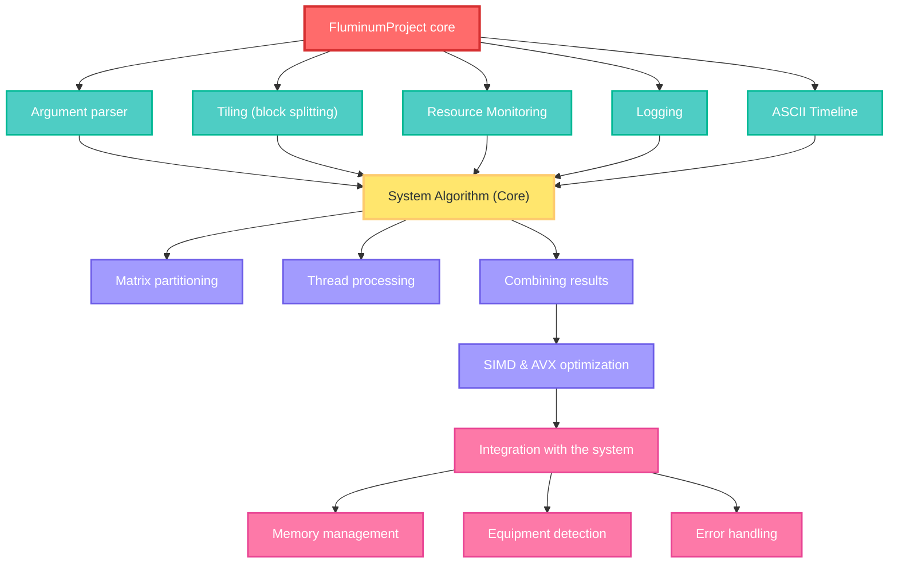

# Fluminum — высокопроизводительные матричные вычисления на C++ (V2.3+)

  Fluminum – это высокопроизводительная консольная программа на C++, ориентированная на умножение и сравнение матриц с учётом современных аппаратных ускорений. Она реализует методики SIMD (Single Instruction Multiple Data) и AVX-256 (Advanced Vector Extensions) для векторизации операций, что позволяет одной инструкцией обрабатывать сразу несколько элементов данных. Fluminum поддерживает многопоточность и многопроцессность, эффективно загружая все доступные ядра процессора для ускорения вычислений. Программа снабжена средствами мониторинга ресурсов, журналирования работы и сохранения итоговых матриц в файлы (например, CSV), обеспечивая удобный консольный интерфейс и подробные логи. Ниже рассмотрены ключевые механизмы и модули программы, а также даны рекомендации для её научного развития.

### Философия проекта

Мы не «продаём» кульбитов — мы показываем свободное, наполненное энтузиазмом исследование в реальном времени. Строгая математическая мысль встречается с машинной архитектурой; результаты имеют значение, но важнее — прозрачность методов, воспроизводимость и аккуратная инженерная подача. 

[](https://www.google.com/search?q=https://github.com/Schreiry/fluminum/blob/main/LICENSE)
[](https://isocpp.org/)
[](https://www.microsoft.com/windows/)

## 🔠 Варианты языка для документации:


### > [ 🇬🇪 ქართულ ენაზე ](https://github.com/Schreiry/fluminum/blob/main/README%5B%20%E1%83%A5%E1%83%90%20%5D.md)
>
### > [ 🇬🇧 In English](https://github.com/Schreiry/fluminum)
>
### > [ 🇺🇦 українською мовою](https://www.google.com/search?q=https://github.com/Schreiry/fluminum/blob/main/README.md)

### > [ 🇫🇷 en français](https://www.google.com/search?q=https://github.com/Schreiry/fluminum/blob/main/README.md)


## 📚 Документация

###  - [📖 Руководство пользователя](https://github.com/Schreiry/fluminum/blob/main/Doc/User%20Guide.md)
###  - [🏗️ Обзор архитектуры](https://www.google.com/search?q=docs/architecture.md)
###  - [⚡ Настройка производительности](https://www.google.com/search?q=docs/performance.md)
###  - [📜 Термины и концепции](https://github.com/Schreiry/fluminum/blob/main/Doc/%D0%9A%D0%BB%D1%8E%D1%87%D0%B5%D0%B2%D1%8B%D0%B5%20%D1%82%D0%B5%D1%80%D0%BC%D0%B8%D0%BD%D1%8B%20%D0%B8%20%D0%BA%D0%BE%D0%BD%D1%86%D0%B5%D0%BF%D1%86%D0%B8%D0%B8.md)


## Ключевые возможности

- Рекурсивная реализация алгоритма Штрассена с настраиваемым порогом переключения на наивный метод.

- Наивный базовый умножитель, оптимизированный с использованием SIMD-инструкций (AVX → SSE2 → scalar) при наличии аппаратной поддержки.

- эффективного использования ядер CPU.

- Системная проверка: определение логических/физических ядер, проверка поддержки SIMD, оценка требуемой памяти и предупреждения о возможных пиковых расходах.

- Обработка неграничного ввода: автоматическое паддинг/анпаддинг матриц, поддержка ввода из файла/консоли/генератора случайных матриц.

- Консольный интерфейс: прогресс-бар, структурированный вывод, CSV-логирование, звуковые уведомления (опционально).

- Отслеживание метрик производительности Компьютера.

- Система ОППК - Оценка прредварительной производительности компьютера.

- Tiling (блочное умножение матриц).


# Оптимизации при умножении матриц


### Традиционный алгоритм и его недостатки

Умножение матриц размерности n×n по математическому определению выполняется тремя вложенными циклами (i, j, k) и требует Θ(n³) операций умножения и сложения.
Наивная реализация параллельна по n, но практическая эффективность её крайне низка: из-за масштабов используемой памяти процессор большую часть времени простаивает в ожидании данных из ОЗУ. По оценкам, в такой реализации процессоры могут быть загружены лишь на доли процента возможностей из-за медленной памяти. Например, Компьютер с AVX2-CPU совершает лишь 7% от теоретического числа операций за секунду наивным алгоритмом

### SIMD-векторизация и AVX

Первый шаг к ускорению — использование SIMD-расширений CPU. Вместо поэлементного умножения Fluminum применяет инструкции AVX, которые одновременно выполняют по нескольку умножений и сложений. На практике алгоритм преобразуется так: скалярный элемент A[i][k] загружается в SIMD-регистр, затем размножается на вектор из 8 последовательных элементов B[k][j..j+7] , Результатом станет вектор из 8 элементов, который накапливается в соответствующие позиции выходной матрицы C. Таким образом векторная формула вычисляет сразу 8 чисел C[i][j..j+7], тогда как классический алгоритм обрабатывал один элемент C[i][j] за раз. Это даёт примерно 8-кратное ускорение однопоточного ядра (во столько раз увеличивается степень параллелизма).
Кроме того, Fluminum может использовать инструкции FMA (fused multiply-add), которые выполняют умножение и сложение за одну команду, что ещё более загружает ALU и снижает накладные расходы.

### Блочное умножение (Tiling)

Дальнейшая оптимизация решает проблему локальности памяти. Fluminum разбивает большие матрицы на небольшие тайлы размером T×T и перемножает их блоками. Это означает, что в самом вложенном цикле работает не один элемент, а целый блок, который целиком помещается в кэш процессора. Как показывают исследования, при правильно подобранном T (порядка √(размер кэша)) такой подход снижает количество кэш-промахов в Θ(n³) раз . На примере Fluminum: если матрица слишком велика, её умножение распадается на череду операций «умножь тайл A на тайл B» — локальные копии блоков матриц «крутимся» в L1/L2 кэше, а результаты аккумулируются в тайлы выходной матрицы. Это значительно уменьшает обращения к медленной памяти, что подтверждается заметным приростом скорости: в экспериментах быстро упорядоченное блочное умножение давало выигрыш в 2–5 раз по сравнению с наивным на тех же данных
.

### Многопоточность и распараллеливание

Fluminum эффективно использует все ядра CPU: работа по блокам матрицы естественно делится между потоками. Каждый поток получает свой диапазон блоков (или строк) выходной матрицы C, над которым выполняет умножение соответствующих подматриц A и B. Поскольку блоки относительно независимы, практически отсутствуют задержки синхронизации при их подсчёте. Теоретически распределение задач на P потоков должно давать ускорение до P-кратного по сравнению с однопоточным запуском, однако на практике накладные расходы на синхронизацию и ресурсы (например, переплетение кэшей) немного снижают масштабирование. По данным проверок, на современных 16–32‑поточных системах наблюдается ускорение ≈20–25× . Так, пример с двухъядерным CPU (4 виртуальных потока) показывает реальный выигрыш ~2× благодаря полному использованию физических ядер и частично гиперпоточности . Fluminum расчитывает сам, уровень загруженности ЦП, и исходя из полученных даных, использует то каличество потоков, которое не навредят общей работе операционной системы и ее процессов, не смотря на автоматизацию, программа позволяет  вручную устанавливать число потоков, давая возможность получить не только контроль над процессом но и адаптировать программу под конкретное железо и случай.


# 🏗️ Архитектура и основные модули




Fluminum построен на модульной архитектуре. В центре — класс Fluminum (в fluminum.cpp), реализующий логику загрузки матриц, управления параллелизмом и вызова оптимизированных вычислительных ядров. Для мониторинга используется отдельный модуль PerformanceMonitor (см. PerformanceMonitor.cpp/.h), который по таймеру или на события измеряет время выполнения и ресурсопотребление. Работа с файлами CSV и логирование выделены в вспомогательные функции, обеспечивающие гибкость ввода-вывода. Отдельные модули отвечают за:

 - Загрузку и сохранение матриц – чтение исходных данных из CSV или других форматов, запись итоговых матриц в файл.

 - Умножение матриц – ядра для перемножения матриц с учётом оптимизаций (см. ниже).

 - Сравнение матриц – функции для проверки совпадения матриц (например, сравнение результатов разных реализаций или проверка корректности).

 - Мониторинг – периодический сбор статистики по времени и ресурсам.

 - Консольный интерфейс и логирование – парсинг командной строки, вывод сообщений, ошибок и статистики в лог.

В целом Fluminum оборачивает сложный алгоритм умножения матриц в удобный инструмент: пользователь запускает программу, передаёт пути к файлам и параметры (размер матрицы, число потоков, режим сравнения и т.п.), а Fluminum выполняет расчёт и выдает отчёт.

# <b> Бенчмарки производительности : </b>


> Производительность Fluminum оценивается с помощью встроенного модуля PerformanceMonitor. Этот модуль измеряет время выполнения основных этапов (UM_Time), а также собирает такие метрики, как загрузка процессорных
> ядер и пропускную способность памяти. На примере таблицы в документации видно, что Fluminum демонстрирует государоформно фантастические ускорения по сравнению с наивной реализацией (OM – «Original Multiplication»). > Так, на системах с 12–32 потоками наблюдается прирост производительности в десятки и даже сотни раз по сравнению с однопоточной реализацией, благодаря сочетанию SIMD, Tiling и многопоточности. Например, на
> процессоре Intel Core i9‑14900 32‑поточная версия показала ускорение ~24.5× по сравнению с однопоточным запуском, а эффективность AVX-оптимизаций приближалась к пределу пропускной способности CPU.


> [!NOTE]
> Важно отметить, что реальные бенчмарки зависят от архитектуры процессора (кэш, тактовая частота, наличие AVX512 и др.) и свойств матриц (плотные или разреженные, размер, выравнивание в памяти). Fluminum обеспечивает > мониторинг, позволяющий сравнивать производительность на разных машинах ( приведены результаты на процессорах Intel и AMD с различным кэшем и частотами) и выявлять узкие места. При необходимости
> разработчик,пользоваьель может ориентироваться на полученные логи и профили – например, обратить внимание на время загрузки данных или на то, сколько времени простаивали CPU между блоками.


> [\!IMPORTANT]
>
> | Процессор | L3 кэш | Ядра/Потоки | Базовая частота | Турбо частота | Память | Объем памяти | ОС |
> |---|---|---|---|---|---|---|---|
> | Intel i9-13900K | 36 MB Intel® Smart Cache | 24/32 | 3.0 ГГц | 6.0 ГГц | DDR5-5600 | 128 ГБ | Windows 11 pro 24H2 |
> | Intel i5-12400 | 18 MB Intel® Smart Cache | 6/12 | 2.4 ГГц | 4.4 ГГц | DDR5-5200 | 32 ГБ | Windows 11 pro 24H2 |
> | Intel i5-10400F | 12 MB Intel® Smart Cache | 6/12 | 2.90 ГГц | 4.30 ГГц | DDR4-2133 | 32 ГБ | Windows 11 pro 24H2 |
> | Intel i7-8600U | 8 MB Intel® Smart Cache | 4/8 | 1.90 ГГц | 4.20 ГГц | DDR4-3200 | 16 ГБ | Windows 11 pro 24H2 |
> | Intel Xeon X5680 | 12 MB Intel® Smart Cache | 6/12 | 3.33 ГГц | 3.60 ГГц | DDR3-1600 | 24 ГБ | Windows pro 10 22H2 |
> | AMD Ryzen 5 7535HS | 16 МБ | 6/12 | 3.3 ГГц | 4.55 ГГц | DDR5-4800 | 16 ГБ | Windows 11 pro 24H2 |
> | AMD Ryzen 5 7530U | 16 МБ | 6/12 | 2 ГГц | 4.4 ГГц | DDR4-3600 | 16 ГБ | Windows 10 22H2 |

### Сводная таблица производительности

Дананя таблица показывает время выполнения `SA_Time` для 1-го и максимального количества потоков, а также рассчитанные показатели производительности: отношение среднего `OM_Time` к `SA_Time` и ускорение `SA_Time`.

## Статистика Экспериметов проведенный на процессорах обьявленных ниже :
> [\!IMPORTANT]
> | Процессор | Потоки | OM\_Time (ср.) | SA\_Time (с) | OM/SA (x) | SA Ускорение (x) |
> | :--- | :--- | ---: | ---: | ---: | ---: |
> | **Intel Core i9-13900K** | 1 | 171.80 | 7.6108 | **\~22.6x** | 1.0x |
> | | **32** | 171.80 | **0.3110** | **\~552.4x** | **\~24.5x** |
> | **Intel Core i5-12400** | 1 | 217.70 | 11.84313 | **\~18.4x** | 1.0x |
> | | **12** | 217.70 | **1.83452** | **\~118.7x** | **\~6.5x** |
> | **Intel Core i5-10400F** | 1 | 286.90 | 12.84313 | **\~22.3x** | 1.0x |
> | | **12** | 286.90 | **2.13990** | **\~134.1x** | **\~6.0x** |
> | **Intel Xeon X5680** | 1 | 493.59 | 32.20330 | **\~15.3x** | 1.0x |
> | | **12** | 493.59 | **28.28180** | **\~17.5x** | **\~1.1x** |
> | **Intel Core i7-8600U** | 1 | 725.75 | 15.44390 | **\~47.0x** | 1.0x |
> | | **8** | 725.75 | **4.36330** | **\~166.3x** | **\~3.5x** |
> | **AMD Ryzen 5 7535HS** | 1 | 325.49 | 13.15830 | **\~24.7x** | 1.0x |
> | | **12** | 325.49 | **2.31333** | **\~140.7x** | **\~5.7x** |
> | **AMD Ryzen 5 7530U** | 1 | 254.12 | 12.99914 | **\~19.5x** | 1.0x |
> | | **12** | 254.12 | **2.50237** | **\~101.6x** | **\~5.2x** |


[ более подробные таблицы и дополнительная информация здесь](https://github.com/Schreiry/fluminum/blob/main/Doc/detailed%20graphs.md)


**Примечание:**

  * `OM_Time (ср.)`: Среднее `OM_Time` для данного процессора по всем доступным потокам.
  * `OM/SA (x)`: Рассчитывается как `OM_Time (ср.) / SA_Time (с)`.
  * `SA Ускорение (x)`: Рассчитывается как `SA_Time (1 поток) / SA_Time (N потоков)`.

> [!TIP]
> | ЦП | Один поток | Многопоточность | **Общее ускорение** |
> |-----|---------------|--------------|-------------------|
> | **i9-13900K** | 23.4× | **574.0×** | 🏆 **Чемпион** |
> | **i5-12400** | 18.6× | **120.4×** | 🥈 **Отлично** |
> | **i5-10400F** | 25.5× | **134.1x** | 🥉 **Выдающееся** |

### Наблюдения :

 -  **Алгоритмическое доминирование :** Только Штрассен обеспечивает ускорение от 18x до 46x.
 
 -  **Мощь параллелизма :** Многопоточность добавляет еще от 3.5x до 24.5x ускорения.
 
 -  **Синергетический взрыв :** Комбинированный эффект дает невероятное улучшение от 100x до 574x, превращая минутные вычисления в задачи, занимающие доли секунды.
 
 -  **Масштабируемость :** Производительность хорошо масштабируется с увеличением числа ядер, демонстрируя эффективную параллелизацию.
 
 -  **Влияние SIMD :** Уже впечатляющие результаты дополнительно усиливаются базовым случаем, оптимизированным с помощью SIMD, хотя его индивидуальный вклад не выделен в этих высокоуровневых тестах.

-----


## 🛠️ Требования и установка

- **Операционная система:** Windows (активно использует WinAPI для функций консоли и информации о системе). Адаптация для Linux/macOS возможна, но требует замены вызовов, специфичных для Windows. **Кроссплатформенность** на данный момент *не поддерживается*. Мы ориентируемся на операционную систему **Windows 11** .
  
- **Компилятор:** Требуется поддержка C++20. **Microsoft Visual C++ (MSVC)** рекомендуется из-за проверок `_MSC_VER`, интринсиков и `#pragma comment(lib, "Psapi.lib")`. (Может быть адаптировано для GCC/Clang с
небольшими изменениями).
 
- **Оборудование:** Настоятельно рекомендуется многоядерный ЦП для получения преимуществ параллелизма. Требуется поддержка AVX или SSE2 для полного ускорения SIMD.


Программа встретит вас интерактивным меню:

1.  **Информация о системе:** Отображает обнаруженную ОЗУ, ядра ЦП и поддержку SIMD.
2.  **Выбор операции:** Выберите между умножением матриц и сравнением матриц.
3.  **Логирование:** Выберите, логировать ли результаты производительности в CSV-файл.
4.  **Размеры:** Введите размеры матриц.
5.  **Оценка памяти:** Просмотрите оценку требуемой ОЗУ.
6.  **Метод ввода:** Выберите случайную генерацию, ввод с консоли или ввод из файла.
7.  **Настройки:** Настройте порог Штрассена, количество потоков и (для сравнения) эпсилон.
8.  **Выполнение:** Наблюдайте за индикатором выполнения во время вычислений.
9.  **Результаты:** Просмотрите подробную статистику производительности и времени.
10. **Сохранение и продолжение:** При желании сохраните результирующую матрицу и выполните другую операцию.

### Интерфейс и взаимодействие с пользователем

Fluminum управляется через консоль. При запуске пользователь передаёт параметры работы: имена входных файлов, размеры обрабатываемых матриц, число потоков, флаги включения мониторинга и логирования, и т.п. Программа выводит информацию о ходе выполнения — например, прогресс умножения блоков — и итоговые данные (время работы, использованные ресурсы). По завершении можно получить итоговые матрицы в CSV‑файлах, а также подробный лог с точными таймингами (каждый блок, общее время, средняя скорость). Такая функциональность облегчает проверку корректности (сравнение с референсными данными) и анализ производительности.

Fluminum умеет автоматически сравнивать две матрицы (например, эталонный результат и собственный вычисленный) поэлементно с учётом допустимой погрешности. Это важно в плавающей арифметике: небольшие расхождения из-за порядка операций считаются эквивалентными. В случае несоответствия программа сообщает позицию первого отличия и величину расхождения, упрощая отладку.


## 📈 План развития

### Версия 2.2 + (Q2 2025) Сейчас

  - [X] Поддержка SIMD/AVX2 (256);
  
  - [x] Приемлемый UI;
     
  - [x] Множественная эффективность на процессоре;
        
  - [x] Оптимизация. по сравнению с предыдущими версиями, она превосходна.
      память используется более эффективно, умнее и рациональнее. при умножении матриц: 2048X 2048 X 2048X 2048 программа использовала 1654 \~ 1850 МБ, сейчас она использует 800 \~ 990 МБ.

  - [x] Алгоритм Штрассена;

  - [x] Пороги;

  - [x] Меньший нагрев ЦП;

  - [x] Студенческая конференция;

### Версии 2.5–2.9 (3 квартал 2025 г.)

- [ ] Алгоритм Копперсмита–Винограда — (В настоящее время отменён из-за неэффективности и высокой ресурсоёмкости);

- [X] Мониторинг производительности;

- [X] Тайлинг (блочное умножение матриц);

- [X] Модули и конфигурация;

- [ ] Поддержка AVX-512;

- [ ] ОППК - В активной разработке;

- [ ] Улучшенный пользовательский интерфейс;

- [ ] CSR/CSC;

- [ ] Численные методы (LU, CG, QR)

- [ ] Профилирование;

- [ ] Профилирование и тестирование;

- [ ] Динамическая пороговая оптимизация;

### Версия 3.0 (4 квартал 2025 г.)

- [ ] Распределённые вычисления (MPI);

- [ ] открытая библиотека;

- [ ] привязки Python;

- [ ] порт веб-ассемблеров;

- [ ] кроссплатформенная поддержка (Linux/macOS);

- [ ] ускорение на GPU (CUDA/OpenCL);

- [ ] квантово-устойчивые алгоритмы;

- [ ] поддержка произвольной точности (Boost.Multiprecision) для финансовых и научных расчётов.

-----

## 🤝 Участие в проекте

Мы приветствуем вклад в проект! Если у вас есть идеи по улучшению, исправлению ошибок или добавлению новых функций:

1.  **Форкните** репозиторий.
2.  Создайте **новую ветку** для вашей функции (`git checkout -b feature/AmazingIdea`).
3.  **Внесите** свои изменения, придерживаясь существующего стиля кода.
4.  **Тщательно протестируйте**.
5.  **Закоммитьте** свои изменения (`git commit -m 'Add some AmazingIdea'`).
6.  **Отправьте** в ветку (`git push origin feature/AmazingIdea`).
7.  Откройте **Pull Request**.

Пожалуйста, убедитесь, что ваши pull requests хорошо описаны и ссылаются на любые соответствующие issues.

## Благодарности:

  - Заместителю декана Грузинского Технического Университета, **Ноне Отхозория**
  - Intel за документацию по AVX/SSE2
  - Microsoft за оптимизации компилятора Visual Studio
  - Сообществу C++ за постоянное вдохновение
  - **Грузинскому Техническому Университету**
  - Друзьям за поддержку

-----

## 📄 Цитирование

Если вы используете Fluminum в своих исследованиях, пожалуйста, цитируйте:

```bibtex
@software{fluminum,
  title={Fluminum: High-Performance Matrix Operations with Strassen's Algorithm},
  author={Schreiry(David Greve)},
  year={2025},
  version={2.2},
  url={https://github.com/Schreiry/fluminum}
}
```

-----

## 📜 Лицензия

Этот проект лицензирован по **лицензии MIT**. Полную информацию см. в файле [LICENSE](https://www.google.com/search?q=LICENSE).

## [](https://opensource.org/licenses/MIT)  [](https://creativecommons.org/licenses/by/4.0/)

Цель проекта, напоминаю. обучение. Я не лучше вас. Вы, скорее всего, хотите услышать, что я хуже вас. Однако ни я, ни вы не можем судить об этом. Я знаю то, чего не знаете вы, а вы знаете то, чего не могу знать я.
спасибо за внимание, не судите строго . 


> Работаем над проектом с 2025 года, 10 февраля, 10:18ч
