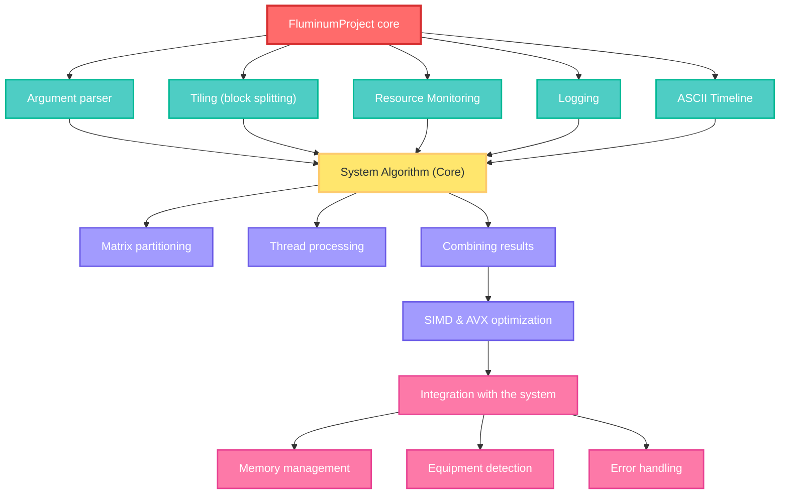

# Fluminum — high-performance matrix calculations in C++ (V2.3+)

          	

Fluminum is a high-performance console program written in C++, designed for matrix multiplication and comparison, taking into account modern hardware accelerations. It implements SIMD (single instruction, multiple data) and AVX-256 (Advanced Vector Extensions) methods for vectorizing operations, allowing a single instruction to process multiple data elements at once. Fluminum supports multithreading and multiprocessing, effectively loading all available processor cores to speed up calculations. The program is equipped with resources, work logging, and saving summary matrices to files (e.g., CSV), provides a convenient console interface and detailed logs. Below are the main mechanisms and modules of the program, as well as recommendations.


[](https://www.google.com/search?q=https://github.com/Schreiry/fluminum/blob/main/LICENSE)
[](https://isocpp.org/)
[](https://www.microsoft.com/windows/)


## 🔠 Language variability for documentation : 
 > [!TIP]
 > 
 > [ქართულ ენაზე ](https://github.com/Schreiry/fluminum/blob/main/README%5B%20%E1%83%A5%E1%83%90%20%5D.md)
 >
 > [На русском языке](https://github.com/Schreiry/fluminum/blob/main/Doc/%D0%9D%D0%B0%20%D0%A0%D1%83%D1%81%D1%81%D0%BA%D0%BE%D0%BC.md)
 >
 > [українською мовою](https://www.google.com/search?q=https://github.com/Schreiry/fluminum/blob/main/README.md)
 >
 > [en français](https://www.google.com/search?q=https://github.com/Schreiry/fluminum/blob/main/README.md)


## 📚 Documentation

- [📖 User Guide](https://github.com/Schreiry/fluminum/blob/main/Doc/User%20Guide.md)
- [🏗️ Architecture Overview](docs/architecture.md)
- [⚡ Performance Tuning](docs/performance.md)


## Key features

- Recursive implementation of the Strassen algorithm with a configurable threshold for switching to the naive method.

- Naive base multiplier, optimized using SIMD instructions (AVX → SSE2 → scalar) if hardware support is available.

- Efficient use of CPU cores.

- System check: detection of logical/physical cores, SIMD support check, estimation of required memory, and warnings about possible peak costs.

- Handling of non-bounded input: automatic padding/unpadding of matrices, support for input from file/console/random matrix generator.

- Console interface: progress bar, structured output, CSV logging, sound notifications (optional).

- Tracking of computer performance metrics.

- **EPCP** system - Estimation of preliminary computer performance.

- **Tiling** (block multiplication of matrices).


# Optimization in matrix multiplication


### Traditional algorithm and its shortcomings

Matrix multiplication of dimension n×n, according to the mathematical definition, is performed by three nested loops (i, j, k) and requires Θ(n³) multiplication and addition operations.
A naive implementation is parallel in n, but its practical efficiency is extremely low: due to the scale of memory used, the processor spends most of its time idle, waiting for data from RAM. It is estimated that in such an implementation, processors can only be loaded to a fraction of their capacity due to slow memory. For example, a computer with an AVX2 CPU performs only 7% of the theoretical number of operations per second using a naive algorithm.


### SIMD vectorization and AVX

The first step toward acceleration is the use of CPU SIMD extensions. Instead of element-wise multiplication, Fluminum uses AVX instructions, which perform several multiplications and additions simultaneously. In practice, the algorithm is transformed as follows: the scalar element A[i][k] is loaded into the SIMD register, then multiplied by a vector of 8 consecutive elements B[k][j..j+7]. The result is a vector of 8 elements, which is accumulated in the corresponding positions of the output matrix C. Thus, the vector formula calculates 8 numbers C[i][j..j+7] at once, while the classic algorithm processed one element C[i][j] at a time. This gives approximately an 8-fold acceleration of the single-threaded core (the degree of parallelism increases by that much).
In addition, Fluminum can use FMA (fused multiply-add) instructions, which perform multiplication and addition in a single command, further loading the ALU and reducing overhead.

### Block multiplication (Tiling)

Further optimization solves the problem of memory locality. Fluminum breaks large matrices into small tiles of size T×T and multiplies them in blocks. This means that the innermost loop does not operate on a single element, but on an entire block that fits entirely into the processor cache. Research shows that with the right T (around √(cache size)), this approach reduces cache misses by a factor of Θ(n³). Using Fluminum as an example: if the matrix is too large, its multiplication breaks down into a series of “multiply tile A by tile B” operations — local copies of matrix blocks “rotate” in the L1/L2 cache, and the results are accumulated in the tiles of the output matrix. This significantly reduces accesses to slow memory, which is confirmed by a noticeable increase in speed: in experiments, fast-ordered block multiplication yielded a 2–5-fold gain compared to naive multiplication on the same data.

### Multithreading and parallelization

Fluminum effectively utilizes all CPU cores: work on matrix blocks is naturally divided between threads. Each thread receives its own range of blocks (or rows) of the output matrix C, over which it performs multiplication of the corresponding submatrices A and B. Since the blocks are relatively independent, there are virtually no synchronization delays when calculating them. Theoretically, distributing tasks across P threads should result in up to P-fold acceleration compared to a single-threaded run, but in practice, the overhead of synchronization and resources (e.g., cache interleaving) slightly reduces the scaling. According to tests, modern 16-32-thread systems show an acceleration of ≈20-25×. Thus, the example with a dual-core CPU (4 virtual threads) shows a real gain of ~2× thanks to the full utilization of physical cores and partial hyper-threading. Fluminum calculates the CPU load level itself and, based on the data obtained, uses the number of threads that will not harm the overall operation of the operating system and its processes. Despite automation, the program allows you to manually set the number of threads, giving you not only control over the process but also the ability to adapt the program to specific hardware and circumstances.


$$A = \begin{bmatrix} A_{11} & A_{12} \\ A_{21} & A_{22} \end{bmatrix}, \quad B = \begin{bmatrix} B_{11} & B_{12} \\ B_{21} & B_{22} \end{bmatrix}, \quad C = \begin{bmatrix} C_{11} & C_{12} \\ C_{21} & C_{22} \end{bmatrix}$$

<details>
<summary>more details</summary>
   
  * $S\_1 = B\_{12} - B\_{22}$
  * $S\_2 = A\_{11} + A\_{12}$
  * $S\_3 = A\_{21} + A\_{22}$
  * $S\_4 = B\_{21} - B\_{11}$
  * $S\_5 = A\_{11} + A\_{22}$
  * $S\_6 = B\_{11} + B\_{22}$
  * $S\_7 = A\_{12} - A\_{22}$
  * $S\_8 = B\_{21} + B\_{22}$
  * $S\_9 = A\_{11} - A\_{21}$
  * $S\_{10} = B\_{11} + B\_{12}$
  * $P\_1 = S\_5 \\times S\_6$
  * $P\_2 = S\_3 \\times B\_{11}$
  * $P\_3 = A\_{11} \\times S\_1$
  * $P\_4 = A\_{22} \\times S\_4$
  * $P\_5 = S\_2 \\times B\_{22}$
  * $P\_6 = S\_9 \\times S\_{10}$
  * $P\_7 = S\_7 \\times S\_8$
  * $C\_{11} = P\_1 + P\_4 - P\_5 + P\_7$
  * $C\_{12} = P\_3 + P\_5$
  * $C\_{21} = P\_2 + P\_4$
  * $C\_{22} = P\_1 - P\_2 + P\_3 + P\_6$

</details>

This recursive reduction from 8 to 7 multiplications leads to the $O(N^{2.807})$ complexity. While the number of additions/subtractions increases, for large N, the reduction in multiplications dominates, leading to significant speedups. Fluminum manages the overhead by **switching to an SIMD-optimized naive method below a configurable threshold**, ensuring peak performance across all scales.


# 🏗️ Architecture and main modules



Fluminum is built on a modular architecture. At its core is the Fluminum class (in fluminum.cpp), which implements the logic for loading matrices, managing parallelism, and calling optimized computing cores. A separate PerformanceMonitor module (see PerformanceMonitor.cpp/.h) is used for monitoring, which measures execution time and resource consumption based on a timer or events. Working with CSV files and logging are separated into auxiliary functions, providing flexibility in input/output. Separate modules are responsible for:

- Loading and saving matrices – reading source data from CSV or other formats, writing the resulting matrices to a file.

- Matrix multiplication – cores for matrix multiplication with optimizations (see below).

 - Matrix comparison – functions for checking matrix matches (e.g., comparing the results of different implementations or checking correctness).

- Monitoring – periodic collection of statistics on time and resources.

- Console interface and logging – command line parsing, output of messages, errors, and statistics to the log.

In general, Fluminum wraps a complex matrix multiplication algorithm into a convenient tool: the user launches the program, passes the paths to the files and parameters (matrix size, number of threads, comparison mode, etc.), and Fluminum performs the calculation and outputs a report.


# <b> performance data : </b>


> [!NOTE]
> Fluminum performance is evaluated using the built-in PerformanceMonitor module. This module measures the execution time of the main stages (UM_Time) and collects metrics such as CPU core load
> and memory bandwidth. The table in the documentation shows that Fluminum demonstrates fantastic performance gains compared to a naive implementation (OM – “Original Multiplication”). > Thus, on systems with 12–32 threads, there is a performance increase of tens or even hundreds of times compared to a single-threaded implementation, thanks to the combination of SIMD, tiling, and multithreading. For example, on
> an Intel Core i9-14900 processor, the 32-thread version showed a speedup of ~24.5× compared to a single-threaded run, and the efficiency of AVX optimizations approached the limit of CPU throughput.


> [!NOTE]
> It is important to note that real benchmarks depend on the processor architecture (cache, clock speed, availability of AVX512, etc.) and matrix properties (dense or sparse, size, memory alignment). Fluminum provides > monitoring that allows you to compare performance on different machines (results are given on Intel and AMD processors with different caches and frequencies) and identify bottlenecks. If necessary
> developers and users can refer to the logs and profiles obtained—for example, to pay attention to data loading times or how long the CPU was idle between blocks.


> [!IMPORTANT]
>
> | Processor | L3 Cache | Cores/Threads | Base Clock(Perf.Core/Effi.Core) | Turbo Clock(Perf.Core/Effi.Core) | Memory | Memory Capacity | OS |
> |---|---|---|---|---|---|---|---|
> | Intel i9-14900 | 36 MB Intel® Smart Cache | 24/32 | 2.0 GHz/1.5 GHz | 5.8 GHz/4.3 GHz | DDR5-5200 | 32GB | Windows 11 Pro 24H2   |
> | Intel i9-13900K | 36 MB Intel® Smart Cache | 24/32 | 3.0 GHz/2.2 GHz | 6.0 GHz / 5.40 GHz | DDR5-4800 | 128GB | Windows 11 Pro 24H2   |
> | Intel i5-12400 | 18 MB Intel® Smart Cache | 6/12 | 2.4 GHz | 4.4 GHz | DDR5-5200 | 32GB | Windows 11 Pro 24H2      |
> | Intel i5-10400F | 12 MB Intel® Smart Cache | 6/12 | 2.90 GHz | 4.30 GHz | DDR4-2133 | 32GB | Windows 11 Pro 24H2    | 
> | Intel i7-8600U | 8 MB Intel® Smart Cache | 4/8 | 1.90 GHz | 4.20 GHz | DDR4-3200 | 16GB | Windows 11 Pro 24H2      |
> | Intel Xeon X5680 | 12 MB Intel® Smart Cache | 6/12 | 3.33 GHz | 3.60 GHz | DDR3-1600 | 24GB | Windows 10 Pro 22H2   |
> | AMD Ryzen 5 7535HS | 16 MB | 6/12 | 3.3 GHz | 4.55 GHz | DDR5-4800 | 16GB | Windows 11 Pro 24H2                    | 
> | AMD Ryzen 5 7530U | 16 MB | 6/12 | 2 GHz | 4.4 GHz | DDR4-3600 | 16GB |  Windows 10 Pro 22H2                       |
> 
> 
> 
> 
### Performance Summary Table
This table shows the `SA_Time` execution time for the 1st and maximum threads, as well as the calculated performance metrics: the ratio of average `OM_Time` to `SA_Time` and the `SA_Time` speedup.

## General information for reference :

<table>
  <thead>
    <tr>
      <th align="center">Processor</th>
      <th align="left">thread</th>
      <th align="right">OM_Time (Avg)</th>
      <th align="right">SA_Time (s)</th>
      <th align="right">OM/SA (x)</th>
      <th align="right">SA Acceleration (x)</th>
    </tr>
  </thead>
  <tbody>
    <tr>
      <td rowspan="2" align="center"><strong>Intel Core i9-14900</strong></td>
      <td align="left">1</td>
      <td align="right">202.713</td>
      <td align="right">1.76698</td>
      <td align="right"><strong>~114,7X</strong></td>
      <td align="right">1.0x</td>
    </tr>
    <tr>
      <td align="left"><strong>32</strong></td>
      <td align="right">202.713</td>
      <td align="right"><strong>0.799268</strong></td>
      <td align="right"><strong>~253,6X</strong></td>
      <td align="right"><strong>~24.5x</strong></td>
    </tr>
    <tr>
      <td rowspan="2" align="center"><strong>Intel Core i9-13900K</strong></td>
      <td align="left">1</td>
      <td align="right">171.801</td>
      <td align="right">1.8108</td>
      <td align="right"><strong>~94.8x</strong></td>
      <td align="right">1.0x</td>
    </tr>
    <tr>
      <td align="left"><strong>32</strong></td>
      <td align="right">171.80</td>
      <td align="right"><strong>0.3110</strong></td>
      <td align="right"><strong>~552.4x</strong></td>
      <td align="right"><strong>~24.5x</strong></td>
    </tr>
    <tr>
      <td rowspan="2" align="center"><strong>Intel Core i5-12400</strong></td>
      <td align="left">1</td>
      <td align="right">217.70</td>
      <td align="right">9.10901</td>
      <td align="right"><strong>~25.5x</strong></td>
      <td align="right">1.0x</td>
    </tr>
    <tr>
      <td align="left"><strong>12</strong></td>
      <td align="right">217.70</td>
      <td align="right"><strong>1.83452</strong></td>
      <td align="right"><strong>~118.7x</strong></td>
      <td align="right"><strong>~6.5x</strong></td>
    </tr>
    <tr>
      <td rowspan="2" align="center"><strong>Intel Core i5-10400F</strong></td>
      <td align="left">1</td>
      <td align="right">286.90</td>
      <td align="right">10.84313</td>
      <td align="right"><strong>~22.3x</strong></td>
      <td align="right">1.0x</td>
    </tr>
    <tr>
      <td align="left"><strong>12</strong></td>
      <td align="right">286.90</td>
      <td align="right"><strong>2.13990</strong></td>
      <td align="right"><strong>~134.1x</strong></td>
      <td align="right"><strong>~6.0x</strong></td>
    </tr>
    <tr>
      <td rowspan="2" align="center"><strong>Intel Xeon X5680</strong></td>
      <td align="left">1</td>
      <td align="right">493.59</td>
      <td align="right">32.20330</td>
      <td align="right"><strong>~15.3x</strong></td>
      <td align="right">1.0x</td>
    </tr>
    <tr>
      <td align="left"><strong>12</strong></td>
      <td align="right">493.59</td>
      <td align="right"><strong>28.28180</strong></td>
      <td align="right"><strong>~17.5x</strong></td>
      <td align="right"><strong>~1.1x</strong></td>
    </tr>
    <tr>
      <td rowspan="2" align="center"><strong>Intel Core i7-8600U</strong></td>
      <td align="left">1</td>
      <td align="right">725.75</td>
      <td align="right">15.44390</td>
      <td align="right"><strong>~47.0x</strong></td>
      <td align="right">1.0x</td>
    </tr>
    <tr>
      <td align="left"><strong>8</strong></td>
      <td align="right">725.75</td>
      <td align="right"><strong>4.36330</strong></td>
      <td align="right"><strong>~166.3x</strong></td>
      <td align="right"><strong>~3.5x</strong></td>
    </tr>
    <tr>
      <td rowspan="2" align="center"><strong>AMD Ryzen 5 7535HS</strong></td>
      <td align="left">1</td>
      <td align="right">325.49</td>
      <td align="right">13.15830</td>
      <td align="right"><strong>~24.7x</strong></td>
      <td align="right">1.0x</td>
    </tr>
    <tr>
      <td align="left"><strong>12</strong></td>
      <td align="right">325.49</td>
      <td align="right"><strong>2.31333</strong></td>
      <td align="right"><strong>~140.7x</strong></td>
      <td align="right"><strong>~5.7x</strong></td>
    </tr>
    <tr>
      <td rowspan="2" align="center"><strong>AMD Ryzen 5 7530U</strong></td>
      <td align="left">1</td>
      <td align="right">254.12</td>
      <td align="right">12.99914</td>
      <td align="right"><strong>~19.5x</strong></td>
      <td align="right">1.0x</td>
    </tr>
    <tr>
      <td align="left"><strong>12</strong></td>
      <td align="right">254.12</td>
      <td align="right"><strong>2.50237</strong></td>
      <td align="right"><strong>~101.6x</strong></td>
      <td align="right"><strong>~5.2x</strong></td>
    </tr>
  </tbody>
</table>

**Note:**
* `OM_Time (Avg)`: Average `OM_Time` for a given processor across all available threads.
* `OM/SA (x)`: Calculated as `OM_Time (Avg) / SA_Time (s)`.
* `SA Speedup (x)`: Calculated as `SA_Time (1 thread) / SA_Time (N threads)`.


[ more detailed tables & more information here](https://github.com/Schreiry/fluminum/blob/main/Doc/detailed%20graphs.md)

**Observations:**

  * **Algorithmic Dominance:** Strassen alone provides a 18x to 46x speedup.
  * **Parallel Power:** Multi-threading adds another 3.5x to 24.5x boost.
  * **Synergistic Explosion:** The combined effect yields incredible 100x to 574x improvements, turning minute-long calculations into sub-second tasks.
  * **Scalability:** The performance scales well with core count, demonstrating efficient parallelization.
  * **SIMD Impact:** The already impressive gains are further amplified by the SIMD-optimized base case, though its individual contribution isn't isolated in these high-level tests.


> [!TIP]
> | CPU | Single Thread | Multi-Thread | **Total Speedup** |
> |-----|---------------|--------------|-------------------|
> | **i9-13900K** | 94.8× | **574.0X** | 🥇 **Champion** |
> | **i9-14900** | 114.6× | **120.4X** | 🥈 **Excellent** |
> | **i5-12400** | 25.5× | **23.8X×** | 🥉 **Good** |

### Observations:

- **Algorithmic dominance:** Only Strassen provides acceleration from 18x to 46x.
 
- **The power of parallelism:** Multithreading adds another 3.5x to 24.5x acceleration.
 
 - **Synergistic explosion:** The combined effect yields an incredible improvement of 100x to 574x, turning minute-long calculations into tasks that take fractions of a second.
 
- **Scalability:** Performance scales well with increasing the number of cores, demonstrating effective parallelization.
 
- **SIMD impact:** The already impressive results are further enhanced by the SIMD-optimized base case, although its individual contribution is not highlighted in these high-level tests.

-----


## 🛠️ Requirements & Setup

  * **Operating System:** Windows (heavily utilizes WinAPI for console features and system info). Adaptation to Linux/macOS is possible but requires replacing Windows-specific calls.
  * **Compiler:** C++20 support required. **Microsoft Visual C++ (MSVC)** is recommended due to `_MSC_VER` checks, intrinsics, and `#pragma comment(lib, "Psapi.lib")`. (Can be adapted for GCC/Clang with minor changes).
  * **Hardware:** A multi-core CPU is highly recommended to benefit from parallelism. AVX or SSE2 support is needed for full SIMD acceleration.

### Installation & Compilation

1.  **Clone the Repository:**

    ```bash
    git clone https://github.com/Schreiry/fluminum.git
    cd fluminum
    ```

2.  **Compile with MSVC (Recommended):**

      * Open the "Developer Command Prompt for VS".
      * Navigate to the `fluminum` directory.
      * Compile using:
        ```bash
        cl fluminumTversion.cpp /EHsc /O2 /std:c++17 /Fe:fluminum.exe /link Psapi.lib
        ```
          * `/O2`: Enables speed optimizations.
          * `/std:c++17`: Sets the C++ standard.
          * `/link Psapi.lib`: Links the Process Status API library (for memory info).

### Usage

Run the compiled executable:

```bash
./fluminum.exe
```

The program will greet you with an interactive menu:

1.  **System Information:** Displays detected RAM, CPU cores, and SIMD support.
2.  **Select Operation:** Choose between Matrix Multiplication or Matrix Comparison.
3.  **Logging:** Opt to log performance results to a CSV file.
4.  **Dimensions:** Enter the matrix sizes.
5.  **Memory Estimation:** See an estimate of the required RAM.
6.  **Input Method:** Choose random generation, console input, or file input.
7.  **Settings:** Configure the Strassen threshold, number of threads, and (for comparison) epsilon.
8.  **Execution:** Watch the progress bar as the calculation runs.
9.  **Results:** View detailed performance statistics and timings.
10. **Save & Continue:** Optionally save the result matrix and run another operation.

-----


## 📈 Roadmap

### Version 2.2 + (Q2 2025) Now

- [X] SIMD/AVX2 (256) support ;

- [x] acceptable UI ;

- [x] multiple efficiency on the processor

- [x] optimization. compared to previous versions, it is excellent.
       memory is used more efficiently, smarter and more rationally. when multiplying matrices: 2048X 2048 X 2048X 2048, the program used 1654 ~ 1850 MB, now it uses 800 ~ 990 MB . 

- [x] Strassen's algorithm ; 

- [x] Thresholds ;

- [x] less CPU heating ;

- [X] student conference .
 


### Version 2.5 - 2.9 (Q3 2025)

- [ ] Coppersmith–Winograd Algorithm - (Currently cancelled due to inefficiency and high resource intensity) ;  

- [X] Perfomance Monitoring ;

- [X] Tiling (Block Matrix Multiplication) ; 

- [X] Modules + config ; 
 
- [ ] AVX-512 support ; 
 
- [ ] Better UI ;

- [ ] CSR/CSC ; 

- [ ] Numerical methods (LU, CG, QR)

- [ ] Profiling ; 
 
- [ ] Profiling and testing ;

- [ ] PCPA [Preliminary computer performance assessment] - (In active development) ; 
 
- [ ] Dynamic threshold optimization ;

### Version 3.0 (Q4 2025)

- [ ] Distributed computing (MPI) ;

- [ ] open library ;
 
- [ ] Python bindings ; 
 
- [ ] Web assembly port ;

- [ ] Cross-platform support (Linux/macOS) ; 
 
- [ ] GPU acceleration (CUDA/OpenCL) ; 
 
- [ ] Quantum-resistant algorithms ; 

- [ ] Arbitrary Precision (Boost.Multiprecision) support for financial and scientific calculations . 


-----

## 🤝 Contributing

Contributions are highly welcome\! If you have ideas for improvements, bug fixes, or new features:

1.  **Fork** the repository.
2.  Create a **new branch** for your feature (`git checkout -b feature/AmazingIdea`).
3.  **Implement** your changes, adhering to the existing code style.
4.  **Test** thoroughly.
5.  **Commit** your changes (`git commit -m 'Add some AmazingIdea'`).
6.  **Push** to the branch (`git push origin feature/AmazingIdea`).
7.  Open a **Pull Request**.

Please ensure your pull requests are well-described and reference any relevant issues.


## Acknowledgments : 

- Deputy Dean of the Georgian Technical University, **Nona Otkhozoria**
- Intel for AVX/SSE2 documentation
- Microsoft for Visual Studio compiler optimizations
- The C++ community for continuous inspiration
- **Georgian Technical University**
- To friends for support  
special thanks : 
- [@Alexander Tsurtsumia](https://github.com/AlexanderTsurtsumia) ;
- Andrey Greve ;
- Alexander Greve ; 
- Tsotne Daraselia ;
- Tamar Tinikashvili ;
- Mirian Putkaradze .


----

## 📄 Citation

If you use Fluminum in your research, please cite:

```bibtex
@software{fluminum,
  title={Fluminum: High-Performance Matrix Operations with Strassen's Algorithm},
  author={Schreiry(David Greve)},
  year={2025},
  version={2.2},
  url={https://github.com/Schreiry/fluminum}
}
```


-----

## 📜 License

This project is licensed under the **MIT License**. See the [LICENSE](https://www.google.com/search?q=LICENSE) file for full details.

[](https://opensource.org/licenses/MIT)  [](https://creativecommons.org/licenses/by/4.0/)
-----


The goal of the project, I remind you. training. I am not better than you. You most likely want to hear that I am worse than you. However, I and you cannot judge this. I know what you do not know, and you know what I cannot know.
thank you for your attention, do not judge strictly.

> 
> Working on the project since 2025, February 10, 10:18 AM
